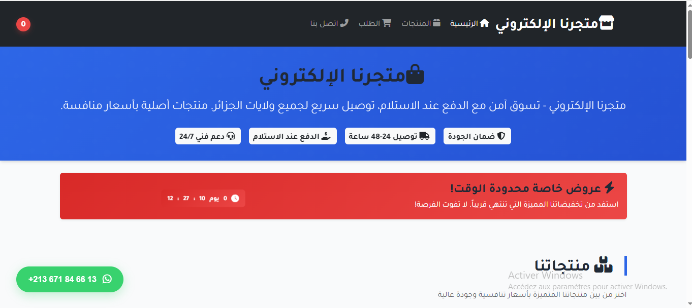
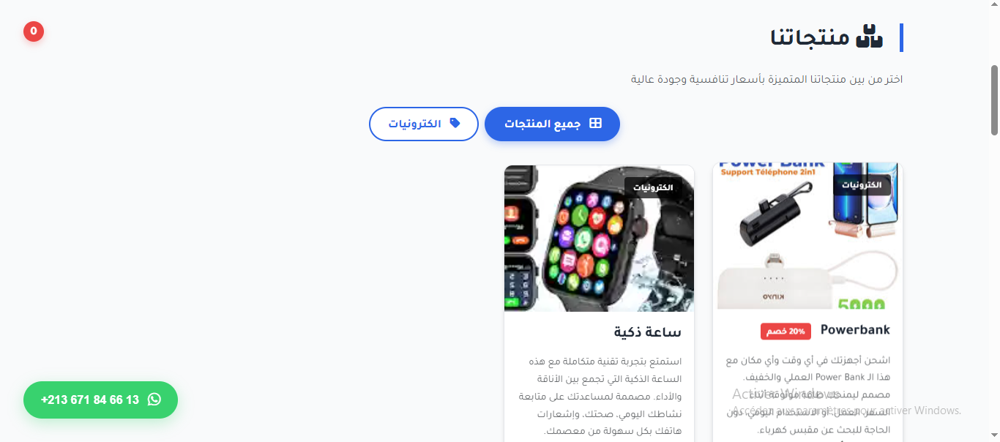
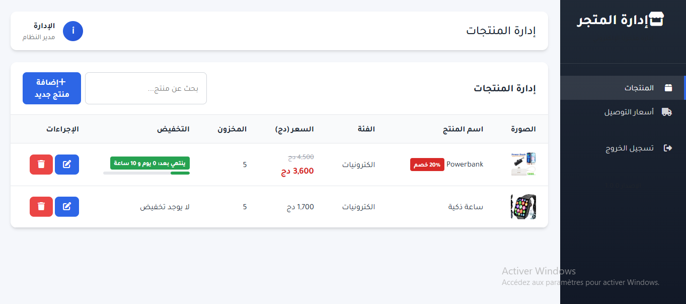

# 🛒 Algerian Cash-on-Delivery E-Commerce Platform

A full-featured **e-commerce platform** tailored for the Algerian market, based on the **Cash on Delivery (COD)** payment model.

The platform offers a modern shopping experience for customers and a secure, professional **admin dashboard** for managing products, delivery costs, and discounts.





---

## 📌 Project Overview

This project is a **Full Stack Web Application** designed to provide:

* Smooth and user-friendly shopping experience for customers.
* Powerful admin management system.
* Automatic delivery cost calculation per wilaya (region).
* Time-based product discounts.
* Secure authentication and session management.

---

## 🚀 Main Features

### 🛍️ Client Side (Storefront)

* Product listing with categories.
* Dynamic shopping cart.
* Automatic total price calculation.
* Cash on Delivery checkout.
* Smart notifications.
* Full Arabic support (RTL layout).

### 🧑‍💼 Admin Dashboard

* Product management (Add / Edit / Delete).
* Time-based discount management.
* Image upload system.
* Delivery cost management per wilaya.
* Sales statistics.
* Auto logout after inactivity.

### 🔐 Security

* Session hardening and ID regeneration.
* CSRF protection with tokens.
* Prepared statements (PDO) to prevent SQL injection.
* Cache prevention.
* Security headers to prevent XSS & Clickjacking.

---

## 🧰 Technologies Used

### Frontend

* HTML5
* CSS3 (Modern UI)
* JavaScript (ES6+)
* Bootstrap 5
* Font Awesome
* Flatpickr

### Backend

* PHP 8+
* MySQL
* PDO

### Security

* OWASP Best Practices
* CSRF Tokens
* Secure Sessions

---

## 📁 Project Structure

```
Algerian Cash-on-Delivery E-Commerce Platform/
│
├── CSS/
│   ├── Index.css       # Store interface styles
│   ├── Login.css       # Login page styles
│   └── Admin.css       # Admin panel styles
│
├── db/
│   ├── config.php      # Database configuration
│   └── assets/         # Documentation & UI images
│       ├── UI.jpg
│       ├── admin.jpg
│       └── product.jpg
│
├── img/
│   ├── boutique.ico
│   ├── gestion.ico
│   └── login.ico
│
├── JS/
│   ├── admin.js        # Admin panel logic
│   ├── Login.js        # Login page logic
│   └── index.js        # Store interface logic
│
├── delivery.php        # Delivery management page
├── espace_admin.php    # Admin dashboard page
├── index.php           # Main store interface
├── get.php             # API endpoint for data fetching
├── Login.php           # Login page
├── Logout.php          # Logout script
├── database/
│   └── store.sql       # Database dump
│
├── License             # Project license
└── README.md           # Project documentation
```

---

## ⚙️ Local Installation

### Requirements

* XAMPP / WAMP / Laragon
* PHP 8+
* MySQL
* Git

### Clone Project

```bash
git clone https://github.com/HoussemBouagal/Algerian-Cash-on-Delivery-E-Commerce-Platform.git
cd Algerian-Cash-on-Delivery-E-Commerce-Platform
```

Move project to:

```
htdocs/  (XAMPP) or www/ (WAMP)
```

### Database Configuration

Edit the database config file:

```php
db/config.php

define('DB_HOST', 'localhost');
define('DB_NAME', 'store');
define('DB_USER', 'root');
define('DB_PASS', '');
```

Create the database:

```sql
CREATE DATABASE store;
```

---

## 🔑 Default Admin Credentials

* **Username:** admin
* **Password:** admin

> ⚠️ Change credentials in production for security.

---

## 🏆 Skill Level

**Mid-Level to Advanced Full Stack Developer**

---

## 📄 License

This project is licensed under the **MIT License**.
Read the full license in the [LICENSE](LICENSE) file.

---

## 👤 Author

**Houssem Bouagal**  
📧 Email: [mouhamedhoussem813@gmail.com](mailto:mouhamedhoussem813@gmail.com)  
🔗 LinkedIn: [Houssem Bouagal](https://www.linkedin.com/in/houssem-eddine-bouagal-98025a297)  

